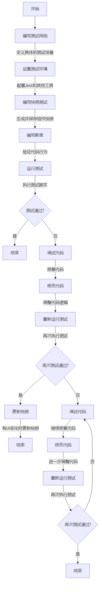

前端开发中的单元测试是指对代码中的最小可测试单位（通常是一个函数或组件）进行测试，以确保其行为符合预期。单元测试可以提高代码质量，减少错误，促进代码的可维护性和可扩展性。

以下是关于前端单元测试的详细学习指南，帮助你从零开始了解并掌握前端单元测试的流程和实践。

---

## 一、为什么要进行前端单元测试？

1. **提高代码质量**：通过及时发现代码中的错误，避免问题扩散到整个项目。
2. **促进重构**：有了可靠的测试，可以大胆地对代码进行重构，而不必担心引入新的错误。
3. **文档作用**：测试用例可以作为代码的使用示例，帮助他人理解代码的功能。
4. **持续集成**：在 CI/CD 流程中集成单元测试，确保代码在每次提交时都保持稳定。

---

## 二、单元测试的基本概念

1. **测试套件（Test Suite）**：一组相关的测试用例，通常对应一个模块或功能。
2. **测试用例（Test Case）**：针对特定功能或代码单元的具体测试。
3. **断言（Assertion）**：用于判断测试结果是否符合预期的条件。
4. **模拟（Mock）**：模拟真实的对象或函数，控制测试环境。

---

## 三、前端单元测试的标准流程



### 1. **选择测试框架和工具**

常用的前端单元测试框架有：

- **Jest**：由 Facebook 开发，适用于 React 以及其他 JavaScript 项目，内置断言库、模拟功能，开箱即用。
- **Mocha**：功能强大的测试框架，需要结合断言库（如 Chai）和测试工具（如 Sinon）使用。
- **Jasmine**：完整的测试框架，内置断言和模拟功能，无需额外依赖。
- **Karma**：测试运行器，可与 Mocha、Jasmine 等框架结合，适用于需要在真实浏览器中运行测试的场景。

### 2. **搭建测试环境**

- **安装依赖**：使用 npm 或 yarn 安装所需的测试框架和工具。
  ```bash
  npm install --save-dev jest
  ```
- **配置测试脚本**：在 `package.json` 中添加测试命令。
  ```json
  "scripts": {
    "test": "jest"
  }
  ```
- **设置配置文件**：根据需要创建配置文件，如 `jest.config.js`。

### 3. **编写测试用例**

- **确定测试范围**：选择需要测试的函数、组件或模块。
- **编写测试代码**：
  - **导入待测试的代码**。
  - **使用测试框架的语法编写测试套件和测试用例**。
  - **添加断言**，验证结果是否符合预期。

示例（使用 Jest）：
```javascript
// sum.js
function sum(a, b) {
  return a + b;
}
module.exports = sum;
```
```javascript
// sum.test.js
const sum = require('./sum');

test('1 加 2 应该等于 3', () => {
  expect(sum(1, 2)).toBe(3);
});
```

### 4. **运行测试**

- 使用命令行运行测试：
  ```bash
  npm test
  ```
- **查看测试结果**：测试框架会输出测试通过或失败的详细信息。

### 5. **分析和优化**

- **修复失败的测试**：根据错误信息，修改代码或测试用例。
- **提高测试覆盖率**：确保代码的主要逻辑和边界情况都得到测试。
- **重构测试代码**：保持测试代码的清晰和可维护性。

---

## 四、前端单元测试的最佳实践

1. **编写可测试的代码**：函数应尽量保持纯粹，减少对外部环境的依赖。
2. **保持测试的独立性**：测试用例之间不应有依赖，确保可以单独运行。
3. **使用模拟（Mock）**：对网络请求、数据库操作等外部依赖进行模拟。
4. **覆盖边界情况**：不仅要测试正常情况，还要测试异常和边界值。
5. **持续集成**：将测试集成到 CI 流程中，自动化运行测试。

---

## 五、常用的测试工具和库

- **断言库**：
  - **Chai**：适用于 Mocha，提供丰富的断言风格。
- **测试辅助工具**：
  - **Sinon**：用于函数的模拟（Mock）、存根（Stub）和间谍（Spy）。
- **组件测试工具**：
  - **Enzyme**：由 Airbnb 开发，适用于 React 组件测试。
  - **React Testing Library**：更关注测试组件的行为而非实现细节。

---

## 六、推荐的学习资源

### 1. **官方文档**

- [Jest 官方文档](https://jestjs.io/zh-Hans/)
- [Mocha 官方文档](https://mochajs.org/)
- [Jasmine 官方文档](https://jasmine.github.io/)

---

## 八、总结

前端单元测试是提升代码质量和开发效率的重要手段。通过学习和实践，你将能够：

- **熟练使用测试框架和工具**。
- **编写高质量的测试用例**。
- **在开发过程中及时发现并修复问题**。
- **提高代码的可维护性和可靠性**。

建议你从官方文档和基础教程开始，结合实际项目进行练习，不断积累经验。

祝你在前端单元测试的学习之路上一切顺利！

在前端开发中，单元测试是确保代码质量和稳定性的重要手段之一。而 Snapshot（快照）测试作为其中的一种测试方式，已被广泛应用于检测 UI 组件和函数输出的变化。下面将详细介绍快照测试的概念、用途以及使用方法。

## 什么是 Snapshot（快照）测试？

**Snapshot 测试**，中文称为**快照测试**，是一种自动化测试技术，用于捕获代码或组件在某一特定时间点的输出结果（或渲染结果），并将其存储为快照文件。在后续的测试运行中，当前输出结果会与之前的快照进行比较，以检测是否存在意料之外的变化。

## 快照文件是什么？

快照文件通常是由测试框架生成和维护的，用于存储被测试对象的输出结果。这些文件通常以特定的格式（如 JSON 或特定的序列化格式）保存，便于在人类可读和机器可比较之间取得平衡。

## Snapshot 测试的用途

1. **检测UI变化**：在前端开发中，组件的 UI 渲染是核心部分。快照测试可以捕获组件的渲染输出（如 DOM 结构或虚拟 DOM），从而检测组件 UI 是否发生了意外变化。

2. **验证函数输出**：对于返回复杂数据结构的纯函数，快照测试可以方便地验证其输出结果是否符合预期。

3. **防止回归**：当代码发生改变时，快照测试可以帮助开发者迅速发现由于修改引入的回归问题。

## 快照测试的工作原理

1. **初次运行**：当第一次运行快照测试时，测试框架会生成被测试对象的输出结果，并将其保存为快照文件。

2. **后续比较**：在后续的测试运行中，测试框架会重新生成当前的输出结果，并与之前保存的快照进行比较。

3. **结果判断**：
   - **匹配**：如果当前输出结果与快照文件一致，测试通过。
   - **不匹配**：如果存在差异，测试失败，并报告差异部分。

4. **快照更新**：如果变化是预期的，开发者可以选择更新快照文件，以反映新的输出结果。

## 如何使用 Snapshot 测试

以 **Jest** 测试框架为例，介绍快照测试的基本使用方法：

### 对于 React 组件

```javascript
import React from 'react';
import renderer from 'react-test-renderer';
import MyComponent from './MyComponent';

test('MyComponent 渲染测试', () => {
  const tree = renderer.create(<MyComponent prop="value" />).toJSON();
  expect(tree).toMatchSnapshot();
});
```

上述代码中：

- `renderer.create()` 渲染组件并生成可序列化的输出。
- `toJSON()` 方法将渲染输出转换为 JSON 对象。
- `expect(tree).toMatchSnapshot()` 将当前输出与快照进行比较。

### 对于函数输出

```javascript
import { generateData } from './utils';

test('generateData 函数输出测试', () => {
  const data = generateData();
  expect(data).toMatchSnapshot();
});
```

## 快照测试的优势

- **简洁高效**：无需编写详细的断言语句，一行代码即可捕获和比较复杂的输出结果。
- **维护方便**：当输出结果发生预期变化时，只需更新快照文件，无需重新编写测试代码。
- **提高覆盖率**：可以轻松地对大量组件和函数进行测试，提高测试覆盖率。

## 快照测试的注意事项

1. **不要轻易更新快照**：在测试失败时，应仔细检查差异，确认变化是预期的，才更新快照文件。否则可能会忽略真正的错误。

2. **控制快照大小**：避免快照文件过于庞大，过大的快照不利于理解和维护。可以考虑拆分测试或仅捕获必要的部分。

3. **处理动态数据**：对于包含日期、随机数等动态内容的输出，需要进行模拟（mock）或排除这些不稳定因素。

4. **非替代其它测试**：快照测试应作为测试策略的一部分，不能完全替代手动断言或交互测试。

## 常用的快照测试工具

- **Jest**：Facebook 开发的 JavaScript 测试框架，内置了快照测试功能，广泛用于 React、Vue 等前端项目。
- **AVA**：支持快照测试的 JavaScript 测试框架，具有并行执行测试的特点。
- **Jasmine / Mocha**：通过结合第三方库（如 `chai-jest-snapshot`），也可以实现快照测试功能。

## 总结

快照测试是前端单元测试中强大而高效的工具，能够快速捕获组件和函数的输出结果，并在后续测试中进行比较，帮助开发者检测意外的变化和回归问题。合理地使用快照测试，可以提高测试效率和代码质量，但也需要注意其局限性，避免过度依赖。

希望以上内容能帮助你深入理解快照测试的概念和使用方法。你的理解有一定道理，但需要澄清的是，**快照测试（Snapshot Testing）**和**Git 版本控制**虽然都涉及到对比和差异检测，但它们的目的、作用和工作方式是不同的。下面我将详细解释二者的区别，以及为什么单纯依赖 Git 对比无法替代快照测试。

## 快照测试 vs. Git 版本控制

### 1. **对象不同**

- **快照测试**：对比的是**代码运行时的输出结果**，如组件渲染后的 UI 结构、函数返回的数据等。这些输出结果可能是由多种代码路径、运行时数据和外部条件共同决定的。

- **Git 版本控制**：对比的是**代码文件的文本内容**，即源代码的变更，包括新增、修改和删除的行。

### 2. **目的不同**

- **快照测试**：旨在检测代码逻辑或输出结果的变化，确保代码的行为符合预期，及时发现由于代码修改引入的**意外行为变化（如回归缺陷）**。

- **Git 版本控制**：主要用于跟踪文件的历史变更，协作开发，查看代码**变更记录**，帮助开发者了解代码如何演变，但不涉及代码的运行结果。

### 3. **工作方式不同**

- **快照测试**：
  - **自动化执行**：在执行单元测试时，测试框架会自动运行代码、捕获输出并与快照比较。
  - **持续集成**：通常集成在持续集成/持续交付（CI/CD）流水线中，自动检测并报告测试结果。
  - **运行时比较**：关注的是运行时的行为，而非静态代码。

- **Git 版本控制**：
  - **手动查看**：需要开发者主动查看差异（如通过 `git diff`、Pull Request 等）。
  - **代码层面**：只对比静态代码文本的变化，不会执行代码或比较运行结果。
  - **版本管理**：更多地用于代码的历史追踪和版本管理。

### 4. **检测范围不同**

- **快照测试**：可以检测代码修改导致的**隐性问题**，即代码表面上没有明显变化，但由于依赖的模块、外部数据等变化，导致输出结果不同。

- **Git 版本控制**：只能检测**显性代码变更**，无法感知代码运行后的输出是否发生变化。

## 示例说明

### 情况一：代码未变，但输出变了

假设你有一个组件 `MyComponent`，它依赖于一个配置文件或外部数据源。即使你的源代码没有任何改动，如果配置文件或数据源发生变化，组件的渲染输出可能会不同。

- **快照测试**：会捕获到输出结果的变化，测试会失败，提醒你检查这种不一致。
- **Git 版本控制**：源代码没有变化，Git 不会有任何提示。

### 情况二：代码改动未被注意到

在协作开发中，可能有人修改了组件内部实现，影响了组件的渲染结果，但在代码评审时未被发现。

- **快照测试**：自动检测输出结果的变化，提示潜在的回归问题。
- **Git 版本控制**：只能看到代码的改动，需要人工仔细审查才能发现问题。

## 为什么不能仅依赖 Git 对比？

1. **自动化程度**：快照测试是自动化的，在每次测试运行时都会比较当前输出和快照，无需人工干预。而 Git 对比需要人工执行并审查，不适合频繁的自动化测试。

2. **运行时行为**：很多 bug 和回归问题是在运行时才会暴露的，代码表面看起来没有问题，但在特定条件下会产生错误的输出。快照测试可以捕获这种运行时的异常，而 Git 无法。

3. **细粒度检测**：快照测试能更精确地检测到输出结果的具体变化，甚至是一个属性或文本的细微差别。而 Git 对比更多地关注代码行的增加或删除，无法深入到运行结果的细节。

4. **团队协作**：在大型团队中，快照测试能提供更可靠的保障，防止他人的改动影响你的代码功能。而仅靠 Git，对每一处代码变更进行细致的人工审查不现实，容易出现疏漏。

## 快照测试与 Git 可以互补

- **结合使用最佳**：Git 版本控制和快照测试是两个不同层面的工具，最佳实践是结合使用。Git 负责代码的变更管理，快照测试负责代码行为的验证。

- **提高代码质量**：快照测试在持续集成过程中起到关键作用，自动检测回归，保障代码质量。

- **审查流程**：Git 提供代码审查的基础，开发者可以在合并代码前审查源代码的变更，而快照测试可以帮助发现审查中可能遗漏的问题。

## 举个具体例子

假设你有以下 React 组件：

```jsx
function Greeting({ name }) {
  return <h1>Hello, {name}!</h1>;
}
```

### 你编写了一个快照测试：

```javascript
test('Greeting 组件渲染测试', () => {
  const tree = renderer.create(<Greeting name="Alice" />).toJSON();
  expect(tree).toMatchSnapshot();
});
```

### 情况一：组件代码未改动，但依赖发生变化

- **外部数据变化**：假设 `name` 现在从某个配置获取，而配置被修改了。

- **结果**：快照测试会失败，提示渲染输出与之前不同。Git 无法检测到这个变化。

### 情况二：组件实现被修改

有人将组件改成了：

```jsx
function Greeting({ name }) {
  return <h2>Welcome, {name}!</h2>;
}
```

- **Git 对比**：可以看到从 `h1` 改成了 `h2`，以及文本的修改。

- **快照测试**：测试会失败，显示新旧输出的差异，提醒开发者确认这种修改是否预期。

- **综合分析**：如果修改是预期的，可以更新快照；如果是无意的，可以及时修正。

## 总结

- **快照测试和 Git 的区别**：
  - 快照测试关注的是代码运行时的输出结果，自动检测运行时的变化。
  - Git 则关注源代码的变更，提供代码版本管理和协作功能。

- **快照测试的价值**：
  - 自动化检测运行时的意外变化。
  - 提供比静态代码对比更深入的行为验证。
  - 补充 Git 无法覆盖的运行时差异。

- **最佳实践**：应同时使用 Git 进行代码管理和快照测试进行行为验证，二者互补提高代码质量和可靠性。

希望以上解释能帮助你更清晰地理解快照测试和 Git 之间的区别，以及为什么在前端单元测试中需要使用快照测试。